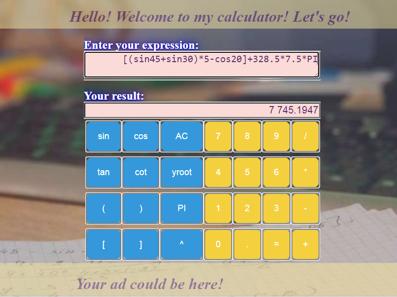
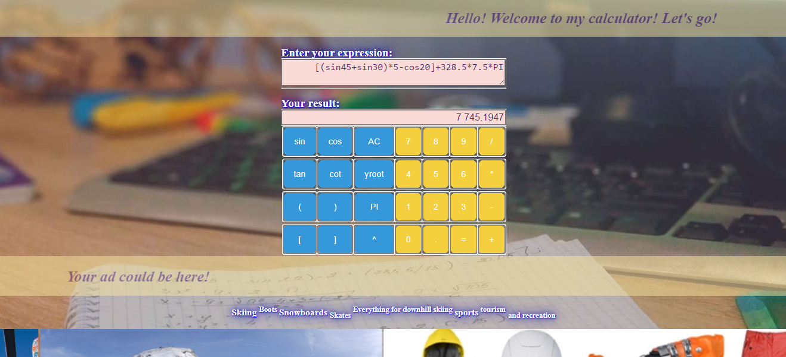

# Web Scientific Calculator

*It's my hobby project*

## Description:
It's a Spring Boot application with Web interface and REST API Controller that process complex string expression and returns you calculated result.

## Technologies:
Gradle 6.6.1, Spring Boot 2.3.4, Java 11, slf4j, Mockito 2.23.0, Selenium 4.0.0 - alpha 3, Spring JPA, junit 4.

## Controllers

| Type | Path | Description |
| ----------- | ------------ | ----------- |
| Web | /* | main web page with pretty simple UI for expression calculation |
| API | /jdbc/calculate?q={expression} | REST API to calculate given expression. GET request allowed only. Parameter _"q"_ is required. For saving result to DB use JDBC. |
| API | /jdbc/calculate/all | REST API to GET all entered expression and their results. This is old API endpoint that is deprecated because don't support pagination. | 
| API | /jpa/calculate?q={expression} | REST API to calculate given expression. GET request allowed only. Parameter _"q"_ is required. For saving result to DB use JPA. |
| API | /jpa/calculate/all?page={number}&size={number} | REST API to GET all entered expression and their results. This is newest API endpoint that support pagination. Allowed to specify page number (by default 0, first page) and size of records in the page (by default 20). | 

## Photo examples of my web-page:

1.  
2.  
3.  

## Testing: 

Application contains Unit and Functional tests. As a testing framework i'm using :
- JUnit4;
- Mockito 2.23.0;
- Selenium 4.0.0 - alpha 3.